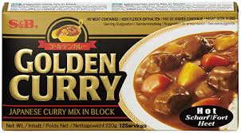

# Quick Curry

> [!info] Auf einen Blick
> **Schwierigkeit:** einfach
>
> _Mengen und Zeiten noch ergänzen._

## Zutaten

| Zutat | Menge | Hinweis |
|-------|-------|---------|
| Curry-Blöcke S&B | _n. B._ | siehe Foto unten |
| Reis | _n. B._ | |
| Fleisch | _n. B._ | am besten Huhn; alternativ Rind oder Schwein (gulaschartig) |
| Zwiebel | _n. B._ | |
| Karotten | _n. B._ | |
| Kartoffel | _n. B._ | |

## Zubereitung

### Express
1. Reis kochen
2. Fleisch und Zwiebeln scharf anbraten
3. Curry-Blöcke und Wasser hinzufügen, auflösen lassen
4. Fertig

### Vollständig
1. Reis kochen
2. Gemüse schneiden
3. Zwiebeln anbraten, beiseitelegen
4. Fleisch braten, beiseitelegen
5. Curry-Blöcke mit Wasser in den Topf geben, auflösen lassen
6. Fleisch und Zwiebeln zurück in den Topf, kurz ziehen lassen
